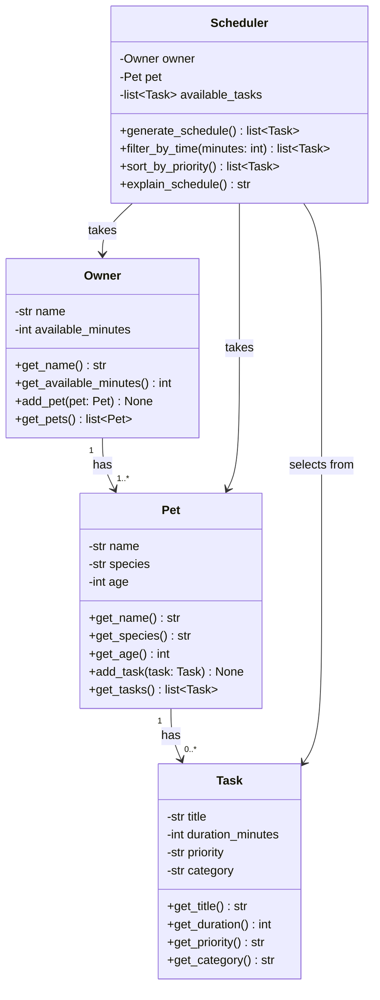

# PawPal+ Class Diagram

```mermaid
classDiagram
    class Owner {
        -str name
        -int available_minutes
        +get_name() str
        +get_available_minutes() int
        +add_pet(pet: Pet) None
        +get_pets() list~Pet~
    }

    class Pet {
        -str name
        -str species
        -int age
        +get_name() str
        +get_species() str
        +get_age() int
        +add_task(task: Task) None
        +get_tasks() list~Task~
    }

    class Task {
        -str title
        -int duration_minutes
        -str priority
        -str category
        +get_title() str
        +get_duration() int
        +get_priority() str
        +get_category() str
    }

    class Scheduler {
        -Owner owner
        -Pet pet
        -list~Task~ available_tasks
        +generate_schedule() list~Task~
        +filter_by_time(minutes: int) list~Task~
        +sort_by_priority() list~Task~
        +explain_schedule() str
    }

    Owner "1" --> "1..*" Pet : has
    Pet "1" --> "0..*" Task : has
    Scheduler --> Owner : takes
    Scheduler --> Pet : takes
    Scheduler --> Task : selects from
```
