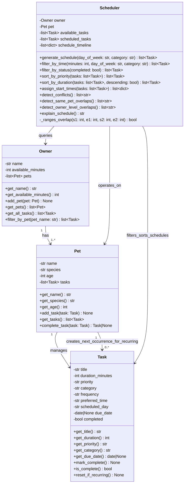

# PawPal+ Class Diagram (Final Implementation)



## Key Implementation Updates from Initial Design

### Task Enhancements

- **New fields**: `frequency` (daily/weekly/as needed), `preferred_time`, `scheduled_day`, `due_date`, `completed`
- **Recurring behavior**: Tasks can auto-spawn next occurrences via `complete_task()` with advanced due dates (timedelta)
- **New methods**: `mark_complete()`, `is_complete()`, `reset_if_recurring()`, `get_due_date()`

### Pet Enhancements

- **Recurring task support**: `complete_task()` marks a task done and creates a fresh pending copy (for daily/weekly tasks)
- **Explicit task list**: `tasks` field now explicit in diagram (was implicit)

### Owner Enhancements

- **Multi-pet queries**: `filter_by_pet()` retrieves tasks for a specific pet (case-insensitive)
- **All-tasks view**: `get_all_tasks()` flattens tasks across all pets
- **Explicit pet list**: `pets` field now explicit in diagram

### Scheduler Enhancements

- **Flexible filtering**:
  - `filter_by_status()` — pending vs. completed tasks
  - `filter_by_time()` now supports day_of_week and category filtering
- **Flexible sorting**:
  - `sort_by_duration()` — order by time (shortest/longest first)
  - `sort_by_priority()` — still available (high→medium→low with SJF tiebreaker)
- **Conflict detection**:
  - `detect_same_pet_overlaps()` — tasks in same pet overlap in time
  - `detect_owner_level_overlaps()` — owner can't be in two places (multi-pet)
  - `_ranges_overlap()` — static helper for interval arithmetic
- **Data structure expansion**:
  - `scheduled_tasks` — tasks that fit in the schedule
  - `schedule_timeline` — list of dicts with start/end minutes and tasks

### Relationship Changes

- **Pet → Task**: Now includes "creates_next_occurrence_for_recurring" to show auto-creation behavior
- **Scheduler → Owner**: Changed to "queries" (can look up multiple pets)
- **Scheduler → Task**: "filters_sorts_schedules" to show comprehensive task manipulation

```

```
